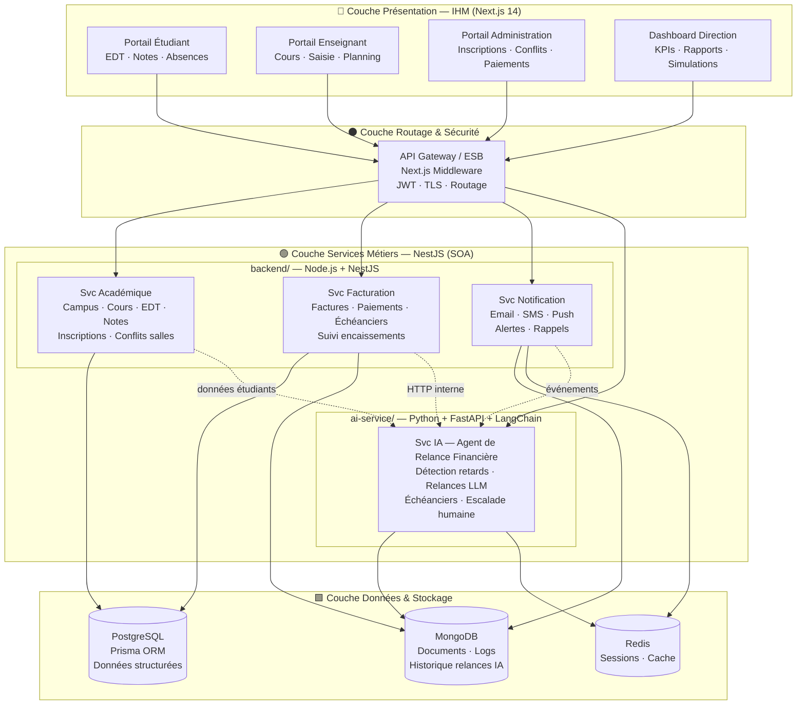
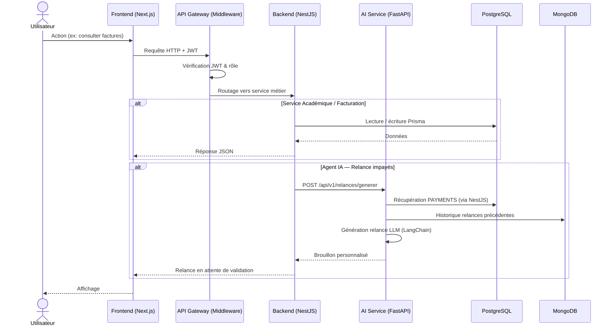

# Architecture SOA — Novacampus Alliance

Architecture orientée services (SOA) en quatre couches, déployée via Docker Compose sur VPS IONOS.

---

## Vue d'ensemble

---

## Flux des requêtes

---

## Services métiers — détail

```mermaid
flowchart LR
    subgraph ACADEMIQUE["Svc Académique"]
        A1[Campus & Programmes]
        A2[Étudiants & Enseignants]
        A3[Cours & Salles]
        A4[Plannings & EDT]
        A5[Notes & Absences]
        A6[Détection conflits]
    end

    subgraph FACTURATION["Svc Facturation"]
        F1[Génération factures]
        F2[Suivi paiements]
        F3[Échéanciers]
        F4[Relances manuelles]
    end

    subgraph NOTIFICATION["Svc Notification"]
        N1[Notifications in-app]
        N2[Emails]
        N3[Alertes EDT]
        N4[Rappels deadlines]
    end

    subgraph IA["Svc IA — Relance Financière"]
        I1[Surveillance PAYMENTS]
        I2[Détection retards]
        I3[Relances LLM personnalisées]
        I4[Proposition échéanciers]
        I5[Escalade humaine]
    end

    FACTURATION --> IA
    IA --> NOTIFICATION
    ACADEMIQUE --> FACTURATION
```

---

## Mapping code ↔ architecture

| Couche | Dossier | Technologie |
|---|---|---|
| Présentation | `frontend/` | Next.js 14, shadcn/ui, Tailwind |
| Gateway | `frontend/middleware.ts` | JWT, routage, protection routes |
| Svc Académique | `backend/src/` (modules) | NestJS, Prisma |
| Svc Facturation | `backend/src/` (modules) | NestJS, Prisma, MongoDB |
| Svc Notification | `backend/src/` (modules) | NestJS, MongoDB, Redis |
| Svc IA | `ai-service/` | FastAPI, LangChain, OpenAI |
| Données relationnelles | `prisma/` | PostgreSQL + Prisma ORM |
| Infrastructure | `docker-compose.yml` | Docker Compose, VPS IONOS |

---

## Légende

| Couleur | Signification |
|---|---|
| 🔵 Bleu | Portails IHM (couche présentation) |
| ⚫ Gris | API Gateway / ESB |
| 🟢 Vert | Services métiers SOA |
| 🟠 Orange | Service IA (innovation) |
| 🟩 Vert clair | Couche données |
