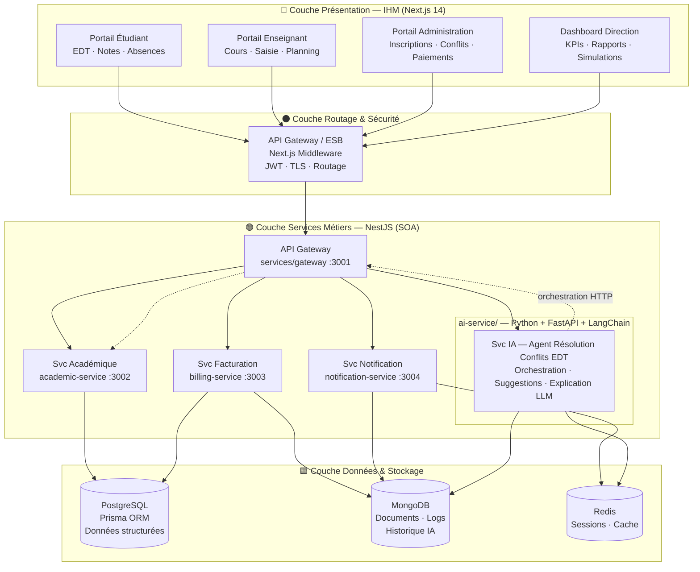
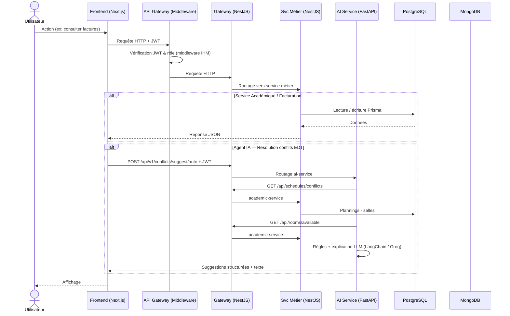
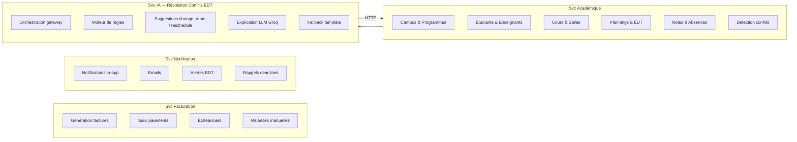
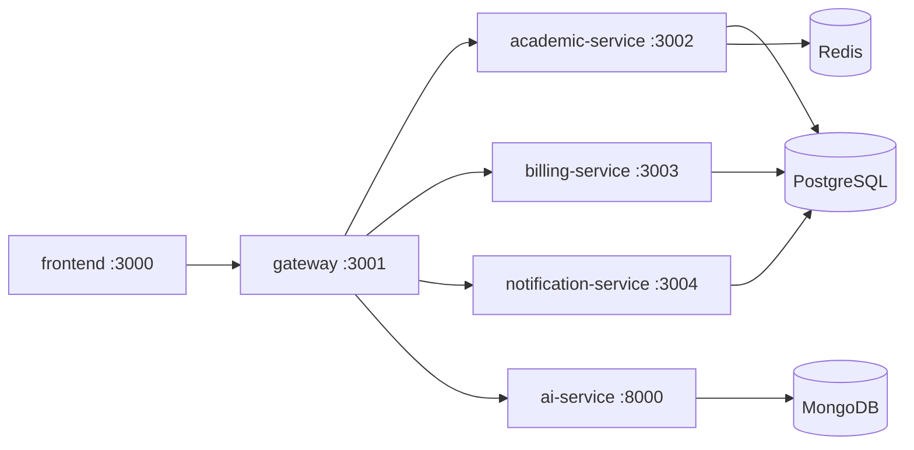

# Architecture SOA — Novacampus Alliance

Architecture orientée services (SOA) en quatre couches, déployée via Docker Compose sur VPS IONOS.

---

## Vue d'ensemble

---

## Flux des requêtes

---

## Services métiers — détail

---

## Mapping code ↔ architecture (implémentation SOA)

| Couche | Dossier | Port | Technologie |
|---|---|---|---|
| Présentation | `frontend/` | 3000 | Next.js 14, middleware JWT IHM |
| **API Gateway** | `services/gateway/` | **3001** | NestJS, http-proxy-middleware |
| Svc Académique | `services/academic-service/` | 3002 | NestJS, Prisma, Redis (auth, campus) |
| Svc Facturation | `services/billing-service/` | 3003 | NestJS, Prisma (payments) |
| Svc Notification | `services/notification-service/` | 3004 | NestJS, Prisma (notifications) |
| Svc IA | `ai-service/` | 8000 | FastAPI, LangChain, Groq — [guide M7](./m7-agent-conflits-edt.md) |
| Données relationnelles | `prisma/` | — | PostgreSQL + Prisma ORM |
| Infrastructure | `docker-compose.yml` | — | Docker Compose, VPS IONOS |

### Flux SOA actuel

Le frontend appelle **uniquement le gateway** (`NEXT_PUBLIC_API_URL`).  
Les services métiers ne sont pas exposés publiquement (réseau Docker interne).

**Arborescence complète des fichiers :** [project-structure.md](./project-structure.md)

---

## Légende

| Couleur | Signification |
|---|---|
| 🔵 Bleu | Portails IHM (couche présentation) |
| ⚫ Gris | API Gateway / ESB |
| 🟢 Vert | Services métiers SOA |
| 🟠 Orange | Service IA (innovation) |
| 🟩 Vert clair | Couche données |
