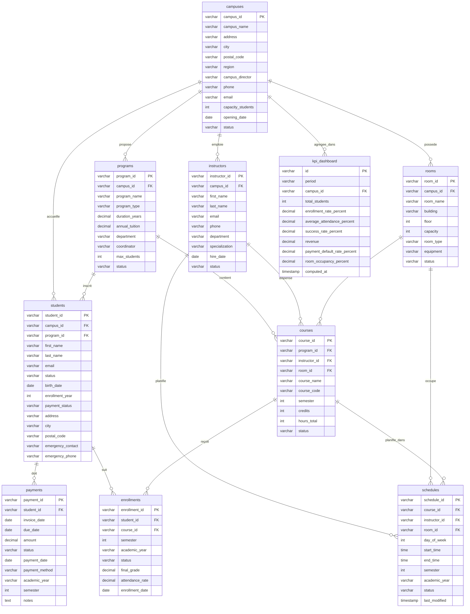

# Schéma Relationnel — Novacampus Alliance

Base de données PostgreSQL. Toutes les clés primaires sont des `varchar` (UUID ou identifiants métier).

---

## Diagramme Entité-Relation



---

## Tables

### `campuses`
| Colonne | Type | Contraintes |
|---|---|---|
| `campus_id` | `varchar(36)` | **PK** |
| `campus_name` | `varchar(180)` | NN |
| `address` | `varchar(255)` | |
| `city` | `varchar(100)` | |
| `postal_code` | `varchar(50)` | |
| `region` | `varchar(180)` | |
| `campus_director` | `varchar(180)` | |
| `phone` | `varchar(50)` | |
| `email` | `varchar(250)` | |
| `capacity_students` | `int` | |
| `opening_date` | `date` | |
| `status` | `varchar(50)` | NN |

---

### `programs`
| Colonne | Type | Contraintes |
|---|---|---|
| `program_id` | `varchar(50)` | **PK** |
| `campus_id` | `varchar(50)` | FK → `campuses.campus_id` NN |
| `program_name` | `varchar(180)` | NN |
| `program_type` | `varchar(100)` | |
| `duration_years` | `decimal(18,0)` | NN |
| `annual_tuition` | `decimal(12,2)` | |
| `department` | `varchar(180)` | |
| `coordinator` | `varchar(180)` | |
| `max_students` | `int` | |
| `status` | `varchar(100)` | NN |

---

### `instructors`
| Colonne | Type | Contraintes |
|---|---|---|
| `instructor_id` | `varchar(50)` | **PK** |
| `campus_id` | `varchar(50)` | FK → `campuses.campus_id` NN |
| `first_name` | `varchar(100)` | NN |
| `last_name` | `varchar(100)` | NN |
| `email` | `varchar(180)` | |
| `phone` | `varchar(50)` | |
| `department` | `varchar(180)` | |
| `specialization` | `varchar(180)` | |
| `hire_date` | `date` | |
| `status` | `varchar(50)` | |

---

### `rooms`
| Colonne | Type | Contraintes |
|---|---|---|
| `room_id` | `varchar(36)` | **PK** |
| `campus_id` | `varchar(50)` | FK → `campuses.campus_id` |
| `room_name` | `varchar(180)` | NN |
| `building` | `varchar(180)` | |
| `floor` | `int` | |
| `capacity` | `int` | |
| `room_type` | `varchar(50)` | |
| `equipment` | `varchar(50)` | |
| `status` | `varchar(50)` | NN |

---

### `students`
| Colonne | Type | Contraintes |
|---|---|---|
| `student_id` | `varchar(36)` | **PK** |
| `campus_id` | `varchar(50)` | FK → `campuses.campus_id` NN |
| `program_id` | `varchar(50)` | FK → `programs.program_id` NN |
| `first_name` | `varchar(100)` | NN |
| `last_name` | `varchar(100)` | NN |
| `email` | `varchar(150)` | NN |
| `status` | `varchar(50)` | |
| `birth_date` | `date` | |
| `enrollment_year` | `int` | NN |
| `payment_status` | `varchar(100)` | NN |
| `address` | `varchar(255)` | |
| `city` | `varchar(180)` | |
| `postal_code` | `varchar(180)` | |
| `emergency_contact` | `varchar(180)` | |
| `emergency_phone` | `varchar(50)` | |

---

### `courses`
| Colonne | Type | Contraintes |
|---|---|---|
| `course_id` | `varchar(50)` | **PK** |
| `program_id` | `varchar(50)` | FK → `programs.program_id` NN |
| `instructor_id` | `varchar(50)` | FK → `instructors.instructor_id` NN |
| `room_id` | `varchar(50)` | FK → `rooms.room_id` |
| `course_name` | `varchar(180)` | NN |
| `course_code` | `varchar(50)` | NN |
| `semester` | `int` | NN |
| `credits` | `int` | NN |
| `hours_total` | `int` | |
| `status` | `varchar(100)` | NN |

---

### `schedules`
| Colonne | Type | Contraintes |
|---|---|---|
| `schedule_id` | `varchar(50)` | **PK** |
| `course_id` | `varchar(50)` | FK → `courses.course_id` |
| `instructor_id` | `varchar(50)` | FK → `instructors.instructor_id` |
| `room_id` | `varchar(50)` | FK → `rooms.room_id` |
| `day_of_week` | `int` | |
| `start_time` | `time` | NN |
| `end_time` | `time` | NN |
| `semester` | `int` | |
| `academic_year` | `varchar(50)` | |
| `status` | `varchar(50)` | |
| `last_modified` | `timestamp` | |

---

### `enrollments`
| Colonne | Type | Contraintes |
|---|---|---|
| `enrollment_id` | `varchar(30)` | **PK** |
| `student_id` | `varchar(50)` | FK → `students.student_id` NN |
| `course_id` | `varchar(50)` | FK → `courses.course_id` NN |
| `semester` | `int` | |
| `academic_year` | `varchar(50)` | NN |
| `status` | `varchar(50)` | |
| `final_grade` | `decimal(4,2)` | |
| `attendance_rate` | `decimal(4,2)` | |
| `enrollment_date` | `date` | NN |

---

### `payments`
| Colonne | Type | Contraintes |
|---|---|---|
| `payment_id` | `varchar(50)` | **PK** |
| `student_id` | `varchar(50)` | FK → `students.student_id` NN |
| `invoice_date` | `date` | NN |
| `due_date` | `date` | NN |
| `amount` | `decimal(10,2)` | NN |
| `status` | `varchar(50)` | NN |
| `payment_date` | `date` | |
| `payment_method` | `varchar(50)` | |
| `academic_year` | `varchar(50)` | NN |
| `semester` | `int` | NN |
| `notes` | `text` | |

---

### `kpi_dashboard`
> Table de reporting pré-agrégée, alimentée par un job calculant les KPIs par campus et par période.

| Colonne | Type | Contraintes |
|---|---|---|
| `id` | `varchar(30)` | **PK** |
| `period` | `varchar(50)` | NN |
| `campus_id` | `varchar(50)` | FK → `campuses.campus_id` NN |
| `total_students` | `int` | |
| `enrollment_rate_percent` | `decimal(4,2)` | |
| `average_attendance_percent` | `decimal(4,2)` | |
| `success_rate_percent` | `decimal(4,2)` | |
| `revenue` | `decimal(12,2)` | |
| `payment_default_rate_percent` | `decimal(4,2)` | |
| `room_occupancy_percent` | `decimal(5,2)` | |
| `computed_at` | `timestamp` | NN |

---

## Relations

```
campuses ──< programs           (1 campus propose plusieurs programmes)
campuses ──< instructors        (1 campus emploie plusieurs enseignants)
campuses ──< rooms              (1 campus possède plusieurs salles)
campuses ──< students           (1 campus accueille plusieurs étudiants)
campuses ──< kpi_dashboard      (1 campus a plusieurs snapshots KPI)

programs ──< students           (1 programme accueille plusieurs étudiants)
programs ──< courses            (1 programme contient plusieurs cours)

instructors ──< courses         (1 enseignant dispense plusieurs cours)
instructors ──< schedules       (1 enseignant apparaît dans plusieurs créneaux)

rooms ──< courses               (1 salle héberge plusieurs cours)
rooms ──< schedules             (1 salle héberge plusieurs créneaux)

students ──< payments           (1 étudiant a plusieurs paiements)
students ──< enrollments        (1 étudiant est inscrit à plusieurs cours)

courses ──< enrollments         (1 cours reçoit plusieurs inscriptions)
courses ──< schedules           (1 cours a plusieurs créneaux horaires)
```

---

## Notes

- `payments.status` : valeurs attendues → `en_attente` | `paye` | `en_retard` | `escalade_humain`
- `enrollments.status` : valeurs attendues → `inscrit` | `valide` | `abandonne` | `echec`
- `schedules.day_of_week` : entier de 1 (lundi) à 7 (dimanche)
- `kpi_dashboard` est une table de lecture seule, jamais modifiée manuellement — alimentée par un job planifié
- Les champs `status` des entités principales (`campuses`, `programs`, `instructors`, `rooms`) permettent l'archivage logique sans suppression physique
