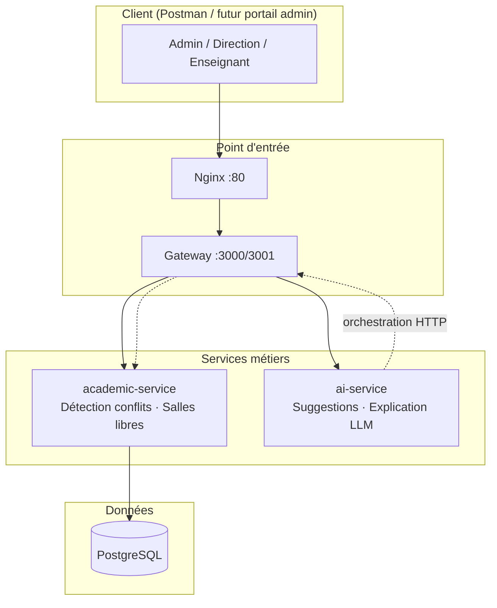
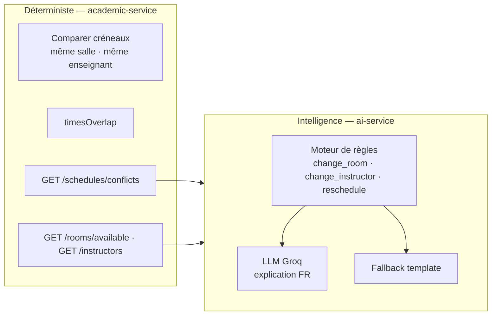
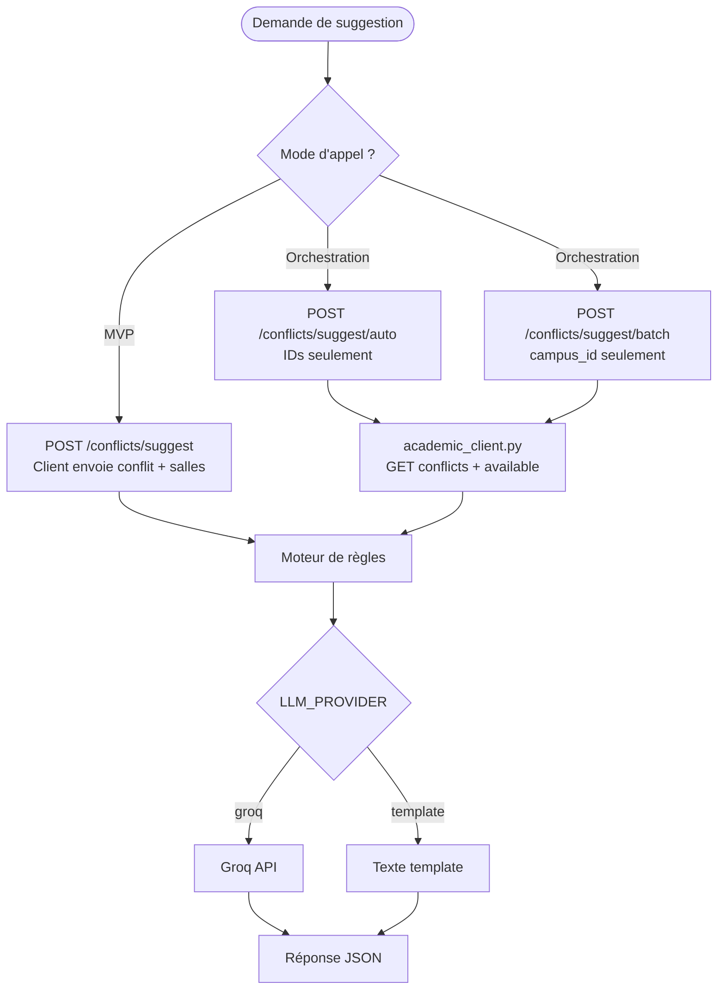
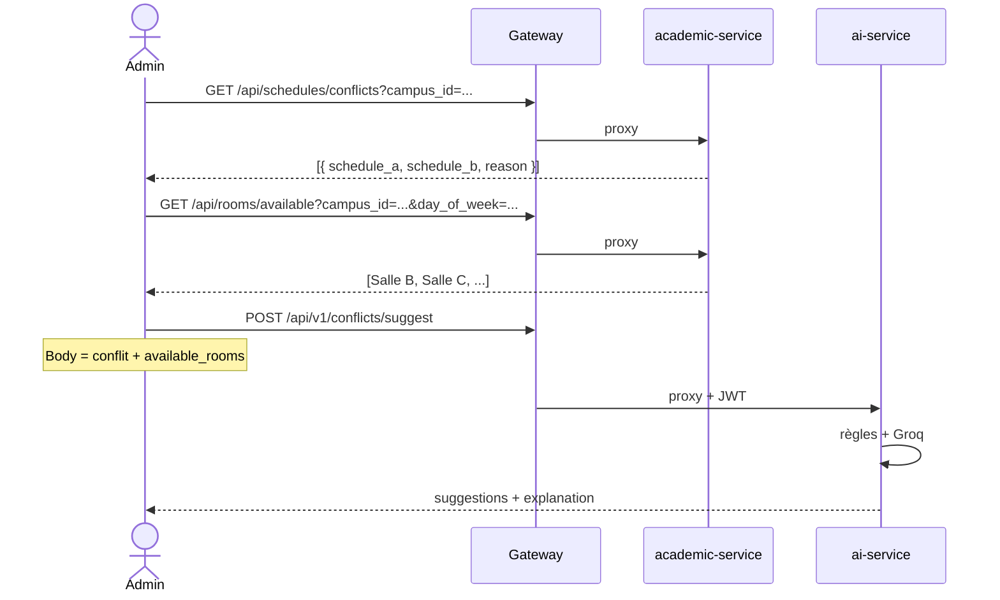
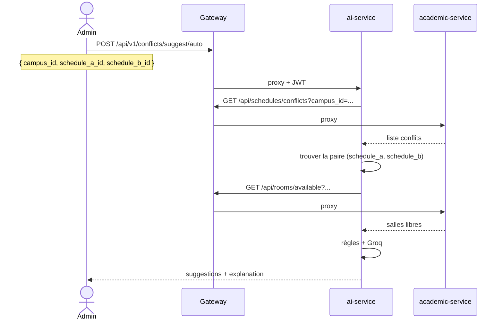
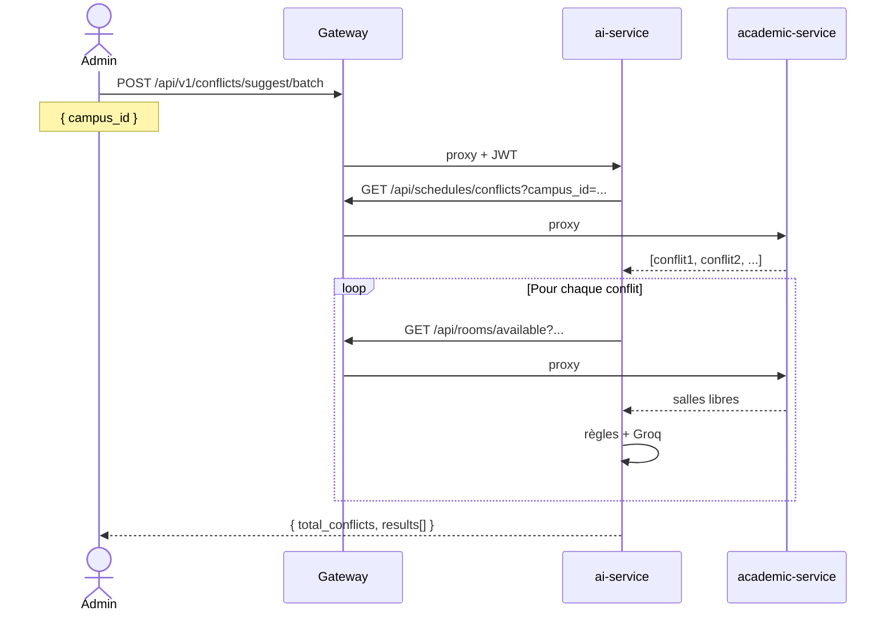
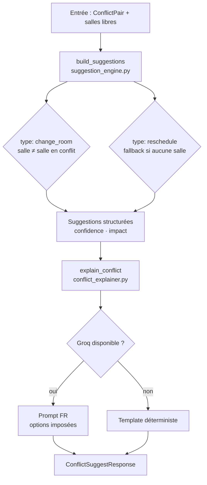
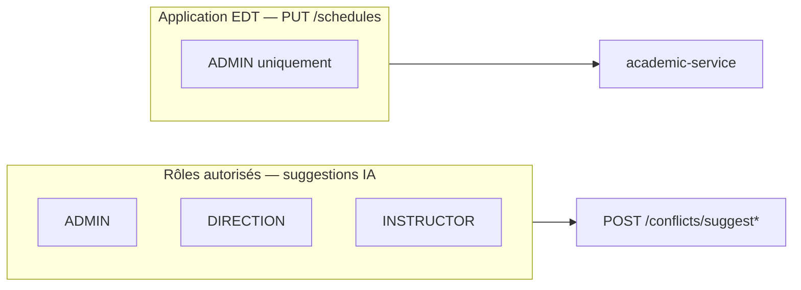

# M7 — Agent IA de résolution des conflits EDT

> Guide technique de l'agent IA **résolution des conflits d'emploi du temps**  
> Service : `ai-service/` (FastAPI + LangChain + Groq)  
> Collection Postman : `postman/m7-agent-conflits-edt.postman_collection.json`

---

## Table des matières

1. [Vue d'ensemble](#vue-densemble)
2. [Positionnement SOA](#positionnement-soa)
3. [Séparation des responsabilités](#séparation-des-responsabilités)
4. [Schéma global](#schéma-global)
5. [Mode MVP — payload manuel](#mode-mvp--payload-manuel)
6. [Mode orchestré — auto & batch](#mode-orchestré--auto--batch)
7. [Pipeline interne de l'agent](#pipeline-interne-de-lagent)
8. [Rôles et sécurité](#rôles-et-sécurité)
9. [Endpoints API](#endpoints-api)
10. [Modèles de réponse](#modèles-de-réponse)
11. [Configuration](#configuration)
12. [Tests Postman](#tests-postman)
13. [Dépannage](#dépannage)

---

## Vue d'ensemble

L'agent IA aide les administrateurs à **résoudre les conflits EDT** : double réservation de **salle** et double affectation **enseignant** sur le même créneau.

| Composant | Rôle |
|-----------|------|
| `academic-service` | **Détecte** les conflits (logique déterministe Prisma) |
| `ai-service` | **Propose** des solutions + **explique** en langage naturel (Groq) |
| Admin | **Applique** manuellement la solution (`PUT /api/schedules/:id`) |

L'agent **ne modifie jamais l'EDT automatiquement** — il recommande, l'humain valide.

---

## Positionnement SOA



---

## Séparation des responsabilités



| Question | Réponse |
|----------|---------|
| Qui détecte le conflit ? | `academic-service` |
| Qui invente des salles libres ? | Personne — uniquement `GET /rooms/available` |
| À quoi sert le LLM ? | Formuler, prioriser, argumenter — pas décider seul |
| Qui applique la correction ? | Admin via `PUT /schedules/:id` |

---

## Schéma global

Deux modes d'appel coexistent :



---

## Mode MVP — payload manuel

Le **client** assemble les données (3 appels séparés ou scripts Postman).



**Quand l'utiliser :** tests unitaires, debug, démo sans dépendance inter-services.

---

## Mode orchestré — auto & batch

L'**ai-service** enchaîne les appels au gateway avec le JWT transmis.

### Suggest auto (un conflit)



### Suggest batch (tous les conflits d'un campus)



**Quand l'utiliser :** intégration réelle, futur bouton « Suggérer » dans le portail admin.

---

## Pipeline interne de l'agent



### Types de suggestions

| Type | Conflit cible | Logique | Confiance |
|------|---------------|---------|-----------|
| `change_room` | `room` | Salle listée par `GET /rooms/available` | `high` |
| `change_instructor` | `instructor` | Enseignant listé par `GET /instructors` (hors enseignants occupés) | `medium` |
| `reschedule` | les deux | Décalage heuristique (jour suivant) | `medium` |

Le LLM reçoit **uniquement** les options structurées — il ne peut pas inventer de salles ni d'enseignants.

Chaque entrée `GET /schedules/conflicts` inclut un champ `type` : `room` ou `instructor`. Un même couple de créneaux peut produire **deux entrées** si les deux conditions sont remplies.

---

## Rôles et sécurité



| Capacité | ADMIN | DIRECTION | INSTRUCTOR | STUDENT |
|----------|:-----:|:---------:|:----------:|:-------:|
| Voir conflits | ✅ | ✅ | ✅ | ❌ |
| Suggestions IA | ✅ | ✅ | ✅ | ❌ |
| Appliquer correction | ✅ | ❌ | ❌ | ❌ |

**Auth :** JWT vérifié dans `ai-service` (`JWT_SECRET` identique à `academic-service`).  
En mode orchestré, le token est **retransmis** au gateway pour appeler l'API académique.

---

## Endpoints API

Tous passent par le gateway : `http://localhost/api/v1/conflicts/...` (Docker) ou `:3001` en dev local.

| Méthode | Route | Auth | Description |
|---------|-------|:----:|-------------|
| `GET` | `/conflicts/llm/status` | Non | État du provider LLM |
| `POST` | `/conflicts/suggest` | JWT | MVP — payload manuel |
| `POST` | `/conflicts/suggest/auto` | JWT | Orchestration — un conflit |
| `POST` | `/conflicts/suggest/batch` | JWT | Orchestration — tout un campus |
| `GET` | `/health` | Non | Santé service (direct `:8000`) |

### Corps — suggest (MVP)

```json
{
  "conflict": {
    "schedule_a": { "schedule_id": "...", "room_id": "...", "instructor_id": "...", "day_of_week": 2, "start_time": "14:00", "end_time": "16:00", "course_name": "..." },
    "schedule_b": { "..." },
    "reason": "Conflit salle ...",
    "type": "room"
  },
  "available_rooms": [
    { "room_id": "...", "room_name": "Salle B", "capacity": 40 }
  ],
  "available_instructors": [
    { "instructor_id": "...", "instructor_name": "Marie Martin" }
  ]
}
```

### Corps — suggest/auto

```json
{
  "campus_id": "campus-xxx",
  "schedule_a_id": "sched-aaa",
  "schedule_b_id": "sched-bbb"
}
```

### Corps — suggest/batch

```json
{
  "campus_id": "campus-xxx"
}
```

---

## Modèles de réponse

### ConflictSuggestResponse

```json
{
  "provider": "groq",
  "model": "llama-3.1-8b-instant",
  "conflict_summary": "Conflit salle A — mardi 14h-16h ...",
  "explanation": "Option 1 (recommandée) : déplacer ...",
  "suggestions": [
    {
      "type": "change_room",
      "target_schedule_id": "sched-bbb",
      "target_course_name": "BDD",
      "proposed_room_id": "room-yyy",
      "proposed_room_name": "Salle B",
      "confidence": "high",
      "impact": "Déplacer BDD vers Salle B au même créneau"
    }
  ]
}
```

### ConflictSuggestBatchResponse

```json
{
  "campus_id": "campus-xxx",
  "total_conflicts": 2,
  "results": [
    {
      "conflict": { "schedule_a": {}, "schedule_b": {}, "reason": "..." },
      "provider": "groq",
      "model": "llama-3.1-8b-instant",
      "conflict_summary": "...",
      "explanation": "...",
      "suggestions": []
    }
  ]
}
```

---

## Configuration

| Variable | Fichier | Description |
|----------|---------|-------------|
| `LLM_PROVIDER` | `ai-service/.env` | `groq` \| `openai` \| `ollama` \| `template` |
| `GROQ_API_KEY` | `ai-service/.env` | Clé API Groq |
| `JWT_SECRET` | `ai-service/.env` + racine | **Identique** à academic-service |
| `BACKEND_URL` | `ai-service/.env` | Gateway pour orchestration (`http://gateway:3000` en Docker) |

---

## Tests Postman

Collection : `postman/m7-agent-conflits-edt.postman_collection.json`

| Dossier | Contenu |
|---------|---------|
| `0 — Auth` | Login admin |
| `1 — IA Status` | `GET /conflicts/llm/status` |
| `2 — MVP manuel` | `POST /suggest` avec payload démo |
| `3 — Orchestration` | Campus → Conflits → `auto` → `batch` |

**Variable :** `base_url` = `http://localhost` (Docker + Nginx).

**Prérequis conflit en base** (une fois avant les tests orchestration) :

```bash
cd services/academic-service
npm run prisma:seed:m7-conflict
```

> L'API `POST /schedules` **bloque** les doublons (409) — le seed M7 insère directement  
> deux créneaux chevauchants + une salle libre (`M7 Salle Libre`).

`POST /suggest/auto` accepte aussi **uniquement** `{ "campus_id": "..." }`  
→ prend automatiquement le premier conflit du campus.

---

## Dépannage

| Symptôme | Cause probable | Solution |
|----------|----------------|----------|
| `No response` sur `:3001` | Gateway non exposée | Utiliser `http://localhost` (Nginx) |
| `401` sur suggest | Token absent/expiré | Refaire Login |
| `403` | Rôle STUDENT | Utiliser admin/direction/enseignant |
| `404` sur suggest/auto | IDs incorrects ou pas de conflit | Vérifier `GET /schedules/conflicts` |
| `503` academic injoignable | `BACKEND_URL` incorrect | Docker : `http://gateway:3000` |
| `configured: false` | `GROQ_API_KEY` vide | Ajouter la clé ou `LLM_PROVIDER=template` |
| LLM down | API Groq indisponible | Fallback automatique vers `template` |

---

## Fichiers source

```
ai-service/app/
├── api/v1/conflicts.py          # Endpoints
├── core/
│   ├── auth.py                  # JWT + propagation token
│   ├── config.py
│   └── llm_client.py
├── llm/conflict_explainer.py    # Prompt Groq + fallback
├── schemas/conflict.py          # DTOs Pydantic
└── services/
    ├── academic_client.py       # Orchestration HTTP
    ├── conflict_resolver.py     # Orchestration métier
    └── suggestion_engine.py     # Règles déterministes
```

**Voir aussi :** [architecture-soa.md](./architecture-soa.md) · [project-structure.md](./project-structure.md)
